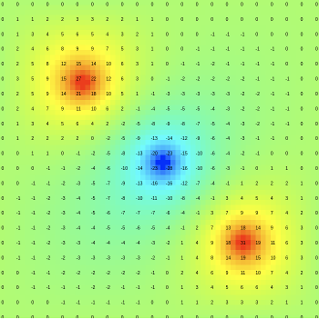

# Heat Simulator

This web tool allows users to specify heat sorces and/or sinks in a 2D domain and see the heat transfer in real time. Dirichlet boundary conditions at the wall are set to 0.

## Using the code

Clone this repository and open the `index.html` file in a browser. To add sources modify the `javascript.js` file by adding values to the `pos_x`, `pos_y` and `intensity` arrays at the top of the file. The canvas can also be extended using the `width` and `height` values.

**NOTE**: The `plotting.js` file is used to render the temperature field, and doesn't need to be changed.
